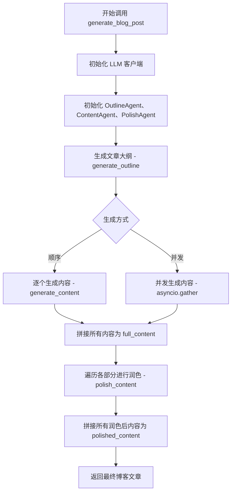

# 写作助手 - AI Blog生成代理 (Agent Writer. Code by Zulu)

一个基于多Agent架构的AI博客文章生成系统，能够根据参考文本自动生成结构完整、内容丰富的博客文章。并给出插图建议。

## 功能特性

- 🚀 三阶段生成流程：大纲 → 内容 → 润色&修正
- 🤖 集成多个专业Agent协同工作
- 📝 支持DeepSeek等OpenAI协议的大语言模型
- 🖥️ 提供命令行和Web界面两种使用方式

## 系统架构



## 安装

1. 克隆本仓库：
```bash
git clone https://github.com/your-repo/Agent-Writer.git
cd 写作助手
```

2. 安装依赖：
```bash
pip install -r requirements.txt
```

## 使用方式

### 命令行模式

```bash
python main.py --api_key your-api-key --file input.txt --output result.md
```

参数说明：
- `--api_key`: API密钥
- `--file`: 输入文本文件路径
- `--output`: 输出文件路径
- `--model`: 模型名称 (默认: deepseek-chat)
- `--base_url`: API基础URL (默认: https://api.deepseek.com/v1)

### Web界面模式

```bash
python gradio_demo.py --api_key your-api-key
```

启动后访问 `http://localhost:7860` 使用Web界面。

## Agent说明

1. **大纲Agent**:
   - 分析参考文本生成文章结构
   - 为每个部分提供写作提示

2. **内容Agent**:
   - 根据大纲和提示生成详细内容
   - 确保内容与主题相关且信息丰富

3. **润色Agent**:
   - 提升语言流畅性和专业性
   - 优化段落结构和过渡
   - 提供插图建议
   - 检查事实准确性

## 项目结构

```
写作助手/
├── main.py            # 主程序入口
├── agents.py          # Agent实现
├── gradio_demo.py     # Web界面
├── LLM/               # LLM集成
│   ├── __init__.py
│   ├── openai.py      # OpenAI风格API客户端
│   ├── exceptions.py  # 异常处理
│   └── example_usage.py
└── README.md          # 本文件
```

## 示例

输入示例 (`input.txt`):
```
人工智能是模拟人类智能的计算机系统...
```

生成结果 (`result.md`):
```markdown
# 人工智能的现状与未来

## 什么是人工智能
人工智能是模拟人类智能的计算机系统...
(建议插图：AI概念图)

## 人工智能的发展历程
...
```

## 未来计划

- 增加对PDF文件输入的支持
- 增加对输出内容风格的控制
- 支持输出图片

## 许可证

MIT License
